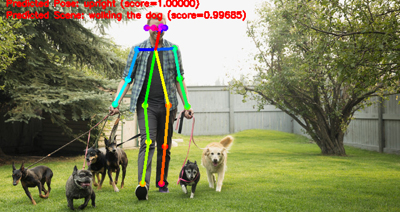
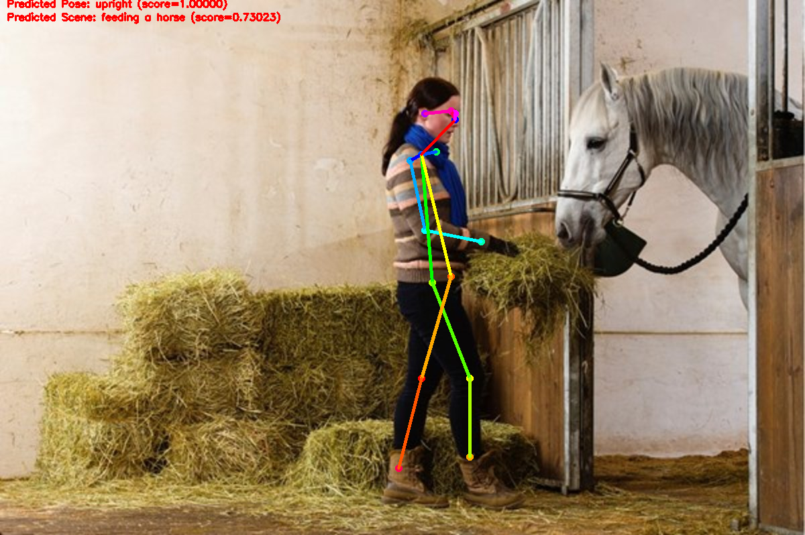

# Human Action Classification

Pose estimation & detection has been minimally implemented using the OpenPose implementation https://github.com/ildoonet/tf-pose-estimation with Tensorflow. For binary classification of poses, (sitting or upright), MobileNet (a CNN originally trained on the ImageNet Large Visual Recognition Challenge dataset), was retrained (final layer) on a dataset of ~1500 images of poses.
For classifying scenes around the person in consideration, we retrain Inception-v3 architecture on the Stanford 40 dataset (9523 images), which incorporates 40 different day-to-day activites. 

Pose classification accuracy is 94.56% and scene recognition rate is 92.3%. 
 
### Testing Ouputs for a Single Image




### Dependencies

The following are required :

- Python3
- tensorflow-gpu 1.13.0 (works with CPU version as well but with a much higher inference time)
- opencv3
- slim
- slidingwindow - (https://github.com/adamrehn/slidingwindow)

### Compiling Locally

```bash
$ git clone https://github.com/dronefreak/human-action-classification.git
$ cd human-action-classification
```
Please check the dependency tree before executing the `pip` install command.

### Pose Estimation and Action Classification on a Single Image

```
$ python3 run_image.py --image=1.jpg
```

Also, please do not forget to change the `address` variable in the code according to your local machine. This is a TODO, in the sense that the viewer can use `os.getcwd()` for an improved generic performance.


### Pose Estimation and Action Classification on Webcam

```
$ python3 run_webcam.py
```
Please note that the inference time for a single image is 1.423 seconds on an average (once the GPU is instantiated), when tested on a system with Ubuntu 18.04, 8GB DDR4 RAM, i5-8240 Intel Processor and NVIDIA GTX 1050Ti (768 Cores with 4GB VRAM). 


### Training on Custom Dataset

There are two classifications tasks happening in this project. One is pose and the other is scene classification. Both follow a similar strategy for training. You would need a training directory structure that looks like:

```
training
│   README.md   
│
└───Action-1
│   │   file011.jpg
│   │   file012.jpg
│ 
└───Action-2
    │   file021.jpg
    │   file022.jpg
```
The `Action-(n)` folders would contain your different poses/scenes that you want to classify. This structure is recommended on tensorflow.org as well. It is advised to use smaller CNNs for pose classification (as there are lesser number of classes), like maybe MobileNet-v1 and a relatively larger CNN for scene classification, like Inception-v3 maybe.

Once the dataset is collected, we commence training by issuing the following command in the termnial (from the cloned directory):

```
python3 scripts/retrain.py --model_dir=tf_files/retrained_graph.pb --output_labels=tf_files/retrained_labels.txt --image_dir=training/
```
Please note that there are multiple options available for this python script, like learning rate, default directories, training steps etc. Please check the code itself for exploring further, and modify them as per your requirements. You ccan also choose the type of architecture you want to retrain.
The trained models are default saved in /tmp, in Ubuntu 18.04.

Check `inception_from_scratch.py` if you want to train the architecture from scratch and not used pre-trained networks. It is defined as a function and hence can be called from any `.py` script. You could try the following commands to achieve this:

```
#Import other libraries as per requirements
from inception_from_scratch import inceptionv3 as incp

WIDTH = 100
HEIGHT = 100
LR = 1e-4
EPOCHS = 20
BATCH_SIZE = 10
MODEL_NAME = 'human-actions-{}-{}-LR-{}.model'.format('inception',LR,FILE_I_END)
model = incp(WIDTH, HEIGHT, 3, LR, output=40, model_name=MODEL_NAME)
#Init train_data
X = np.array([i[1] for i in train_data]).reshape(-1,WIDTH,HEIGHT,3)
Y = [i[2] for i in train_data]
model.fit(X,Y,20, batch_size = 5)
model.save(MODEL_NAME)
```

If you receive an error saying something like `No module named '_pafprocess' you need to build c++ library for pafprocess.`
please follow these steps to resolve them:
```
$ cd tf_pose/pafprocess/
$ swig -python -c++ pafprocess.i 
$ python setup.py build_ext --inplace
```

## References

### Lifting from the deep

[1] Arxiv Paper : https://arxiv.org/abs/1701.00295

[2] https://github.com/DenisTome/Lifting-from-the-Deep-release

### Mobilenet

[1] Original Paper : https://arxiv.org/abs/1704.04861

[2] Pretrained model (Pose estimation) : https://github.com/tensorflow/models/blob/master/slim/nets/mobilenet_v1.md

### Dataset
[1] Stanford 40 : http://vision.stanford.edu/Datasets/40actions.html

### Libraries

[1] Tensorpack : https://github.com/ppwwyyxx/tensorpack

### Tensorflow Tips

[1] Freeze graph : https://github.com/tensorflow/tensorflow/blob/master/tensorflow/python/tools/freeze_graph.py

[2] Optimize graph : https://codelabs.developers.google.com/codelabs/tensorflow-for-poets-2


